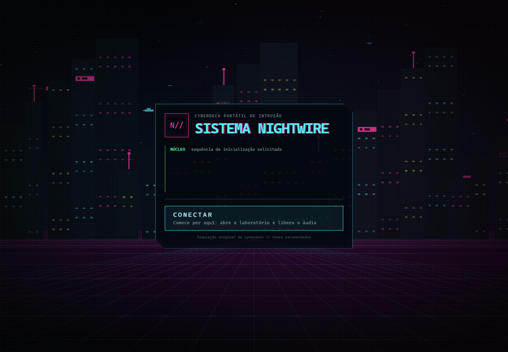
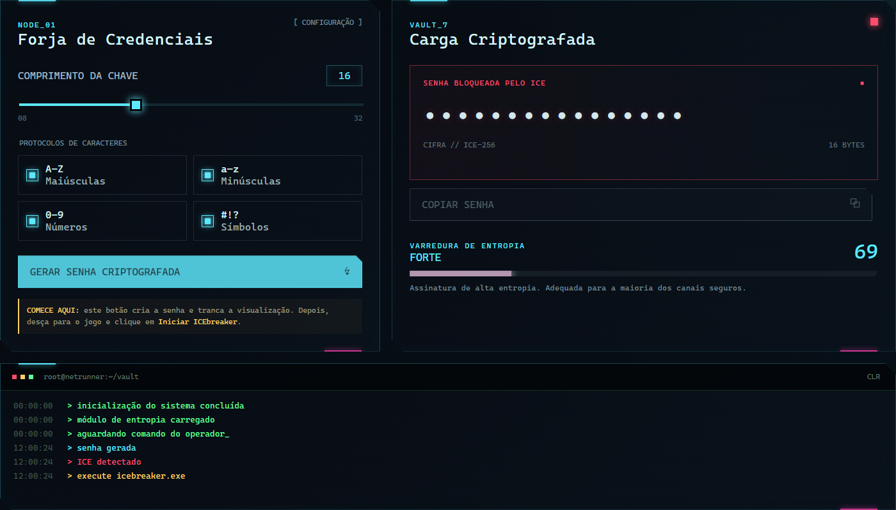
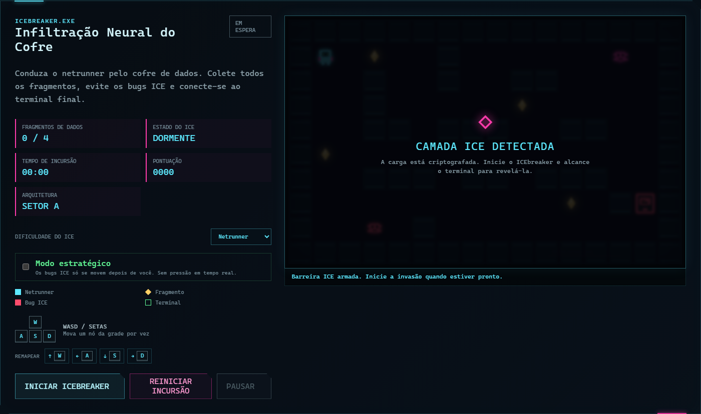
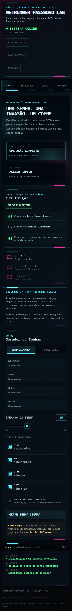

# Netrunner Password Lab

Um laboratório cyberpunk de senhas com gerador seguro, análise de força e um
minijogo em pixel art para desbloquear a senha.



| Laboratório | ICEbreaker |
| --- | --- |
|  |  |



Demonstração pública:
<https://marcusguedess.github.io/netrunner-password-lab/>

## Visão geral

O Netrunner Password Lab é um experimento de produto digital que combina um
gerador de senhas com uma interface inspirada em cyberpunk e um minijogo em
Canvas. A senha é criada no navegador e permanece mascarada até que o usuário
conclua o desafio do ICEbreaker.

O projeto é totalmente frontend. Não existe banco de dados, autenticação ou
serviço externo envolvido, e a senha real não é salva em `localStorage`.

O bloqueio por ICE faz parte da experiência do produto. Ele não substitui
criptografia real contra alguém que tenha controle das ferramentas de
desenvolvimento do navegador.

A direção visual usa o cyberpunk como linguagem para tornar uma ferramenta
utilitária mais memorável: HUDs densos, pixel art procedural, áudio sintetizado
e uma camada lúdica que reforça a ideia de proteger e revelar uma credencial.
Há um pouco de carta de amor ao gênero, mas com foco em produto, interação e
creative coding.

## Como jogar

1. Conecte-se ao cyberdeck pela tela de inicialização.
2. Escolha o comprimento e os grupos de caracteres da senha.
3. Gere a carga criptografada. A senha permanecerá mascarada pelo ICE.
4. Inicie o ICEbreaker e mova o netrunner com **WASD**, **setas** ou os
   controles direcionais em telas sensíveis ao toque.
5. Colete os quatro fragmentos de dados sem encostar nos bugs ICE.
6. Cada fragmento carrega um Pulso Fantasma, que pode congelar bugs ICE por
   alguns segundos.
7. Controle o nível de TRACE: tempo, movimentos e batidas em paredes deixam a
   rede mais perto de rastrear a incursão.
8. Alcance o terminal final para descriptografar e copiar a senha.

O **modo estratégico** elimina a pressão em tempo real: os bugs ICE se movem
somente depois de uma ação do jogador.

## Funcionalidades

- Geração de senhas entre 8 e 32 caracteres com Web Crypto API
- Seleção de letras maiúsculas, minúsculas, números e símbolos
- Inclusão garantida de pelo menos um caractere de cada grupo selecionado
- Análise de força com score, classificação, feedback e dicas de melhoria
- Frases-senha, perfis recomendados e exclusão de caracteres ambíguos
- Modo rápido para gerar e copiar sem jogar
- Senha mascarada até a conclusão do desafio
- Minijogo em Canvas com movimentação em grade, fragmentos, inimigos e terminal
- Pixel art procedural, HUD animado, cidade de boot e sprites em Canvas
- Trilha ambiente, efeitos sintetizados e mixer com Web Audio API
- Controles por teclado, toque, modo estratégico e remapeamento por sessão
- Tutorial jogável, modo leve, brilho reduzido e controles maiores
- Dificuldades, cronômetro, pontuação, pausa, TRACE e conquistas locais
- Desafio diário, carreira local e ranking com metadados não sensíveis
- Expiração automática da credencial após inatividade
- Funcionamento offline como PWA com Service Worker
- Layout responsivo para desktop e telas menores

## Decisões de produto

- **Gerador como minijogo:** a camada de ICEbreaker transforma uma ação
  utilitária em uma experiência interativa. O objetivo é criar retenção,
  ritmo e identidade visual sem comprometer a função principal: gerar uma senha
  forte.
- **Aplicação totalmente frontend:** o projeto roda como site estático para
  reduzir superfície operacional, facilitar publicação no GitHub Pages e manter
  a senha no contexto local do navegador.
- **Ranking sem senha:** a carreira local registra apenas metadados de jogo,
  como pontuação, tempo, dificuldade e data. A senha gerada não entra no
  ranking nem é persistida em armazenamento local.

## Tecnologias utilizadas

- HTML5 semântico
- CSS com layout responsivo, animações e efeitos de HUD
- JavaScript em módulos ES
- Canvas API para o ICEbreaker
- Web Crypto API para geração segura
- Clipboard API para cópia da senha
- Web Audio API para áudio gerado no navegador
- Service Worker e Web App Manifest para funcionamento offline
- GitHub Actions para publicação no GitHub Pages
- Playwright para testes E2E em Chromium, Firefox e viewports móveis

Não há dependências de runtime nem etapa de build. O Playwright é utilizado
somente no ambiente de desenvolvimento e CI. Os arquivos publicados continuam
sendo HTML, CSS e JavaScript estáticos.

Os testes unitários usam o executor nativo do Node.js.

## Comandos rápidos

```bash
# servidor local
python -m http.server 8080

# instalar ferramentas de desenvolvimento
npm ci

# testes automatizados
npm test

# testes de interface
npm run test:e2e

# validação estrutural, segurança e testes
npm run check

# atualizar capturas do README
npm run screenshots
```

## Como rodar localmente

Como o JavaScript usa módulos ES, rode o projeto por um servidor local em vez
de abrir o arquivo diretamente pelo explorador.

Com Python:

```bash
python -m http.server 8080
```

Depois, acesse:

```text
http://localhost:8080
```

Também é possível usar a extensão Live Server no VS Code e abrir o
`index.html`.

Para executar os testes:

```bash
npm run check
npm run test:e2e
```

## Compatibilidade

O projeto foi pensado para versões atuais de Chrome, Edge, Firefox e Safari.
Alguns recursos dependem de APIs modernas do navegador:

- O áudio começa somente depois do clique em **Conectar**, conforme as regras
  de reprodução automática dos navegadores.
- A cópia da senha usa a Clipboard API e funciona melhor em `localhost` ou
  conexões HTTPS, como o GitHub Pages.
- O gerador exige suporte à Web Crypto API.

## Status atual

O projeto está em versão estável para demonstração pública e portfólio. A
aplicação principal, o PWA, o fluxo de publicação, os testes unitários e os
testes E2E estão implementados.

Limitações conhecidas:

- O ICEbreaker é uma camada de interação, não uma barreira criptográfica contra
  o próprio operador do navegador.
- A senha existe temporariamente na memória enquanto a sessão está ativa.
- A Clipboard API depende do contexto do navegador e funciona melhor em
  `localhost` ou HTTPS.
- A validação visual em Safari/iPhone real ainda está listada como melhoria
  futura.

## Como publicar no GitHub Pages

O repositório já inclui o fluxo de automação
`.github/workflows/pages.yml`, que publica o site estático sem etapa de build.

1. Envie o projeto para um repositório chamado `netrunner-password-lab`.
2. No GitHub, abra **Settings > Pages**.
3. Em **Build and deployment**, selecione **GitHub Actions** como fonte.
4. Envie as alterações para a ramificação `main`.
5. Aguarde a automação **Deploy static site to Pages** concluir.

O site ficará disponível em:

```text
https://<usuario>.github.io/netrunner-password-lab/
```

Todos os caminhos usados pela aplicação são relativos, portanto o projeto
funciona corretamente dentro do subdiretório do GitHub Pages.

## Estrutura de pastas

```text
netrunner-password-lab/
├── .github/
│   ├── workflows/
│   │   ├── codeql.yml
│   │   └── pages.yml
│   ├── dependabot.yml
│   └── REPOSITORY_HARDENING.md
├── assets/
│   ├── screenshots/
│   ├── icon-192.png
│   ├── icon-512.png
│   ├── netrunner-password-lab-preview.png
│   └── README.md
├── css/
│   ├── 404.css
│   └── style.css
├── js/
│   ├── app.js
│   ├── audio.js
│   ├── game.js
│   ├── password.js
│   ├── scores.js
│   └── visuals.js
├── scripts/
│   ├── capture-previews.mjs
│   ├── generate-icons.mjs
│   └── validate.mjs
├── tests/
│   ├── e2e/
│   ├── game-map.test.js
│   ├── password.test.js
│   └── scores.test.js
├── index.html
├── 404.html
├── CHANGELOG.md
├── CREDITS.md
├── LICENSE
├── manifest.webmanifest
├── package-lock.json
├── package.json
├── playwright.config.js
├── SECURITY-REVIEW.md
├── SECURITY.md
├── sw.js
└── README.md
```

`password.js` concentra geração e análise. `game.js` controla mapa, colisões,
inimigos e renderização. `audio.js` produz a atmosfera sonora sem arquivos
externos, enquanto `visuals.js` desenha a cidade e a chuva de dados. `scores.js`
limita e valida o ranking local. `app.js` integra a interface, os logs e o
estado de desbloqueio.

## Aprendizados do projeto

O principal exercício foi combinar uma ferramenta funcional com uma mecânica
de jogo sem misturar responsabilidades. O gerador continua independente do
Canvas, enquanto a aplicação coordena o momento em que a credencial pode ser
revelada.

Outro ponto importante foi tratar a Web Crypto API corretamente, incluindo a
seleção sem viés de caracteres e o embaralhamento final da senha. No jogo, cada
arquitetura é testada automaticamente para confirmar que os quatro fragmentos
e o terminal permanecem alcançáveis.

## Próximas melhorias

- Comprimir imagens e capturas para reduzir ainda mais o peso inicial do site
- Testar visualmente em Safari/iPhone real e ajustar qualquer diferença de
  layout, áudio ou PWA
- Criar uma campanha com narrativa entre os setores
- Adicionar sprites desenhados quadro a quadro, substituindo parte das formas
  procedurais do Canvas
- Executar testes assistidos com usuários e revisar o onboarding a partir das
  dificuldades observadas
- Disponibilizar traduções opcionais sem retirar o português como idioma padrão

## Créditos

Conceito, direção criativa e desenvolvimento por **Marcus**.

Os detalhes de autoria e identidade estão em [CREDITS.md](CREDITS.md).

## Licença

Distribuído sob a licença MIT. Consulte o arquivo [LICENSE](LICENSE).
